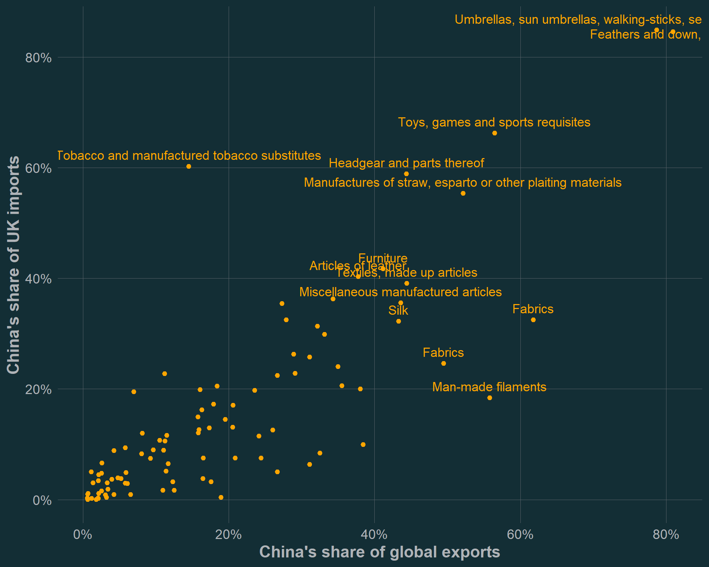

# The United Kingdom's Reliance on China for Imports.

My simple analysis of the UK's reliance on China for the import of goods and services.

I've used the HS2 level categorisation for goods and services but simply changing "2" in line 156 to a "4" would get you the HS4 level categorisation (more granular).

Similarly, you can change the trading parter to the US (2nd largest exporter to the UK) or any other country by replacing the CHN iso 3 code to USA etc.

